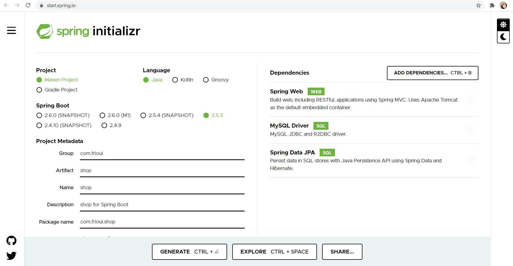
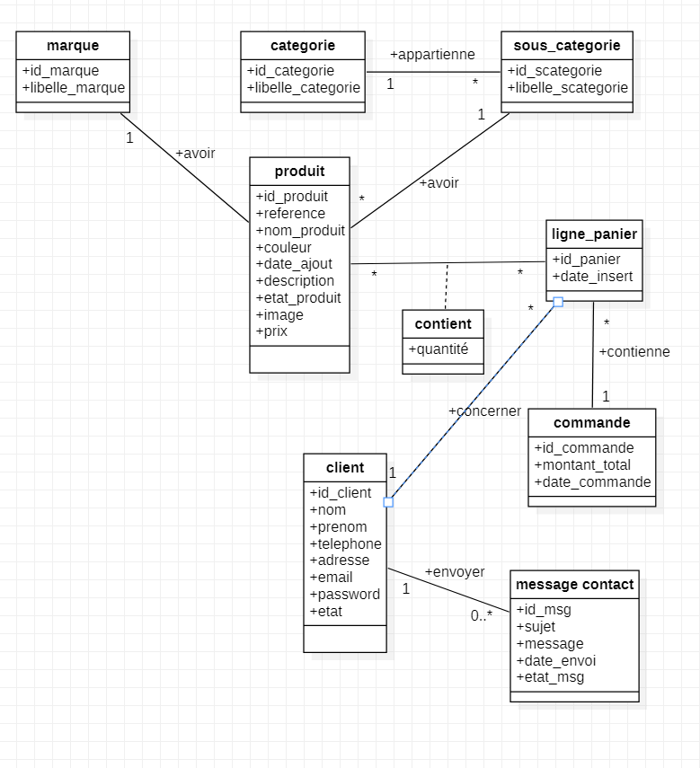
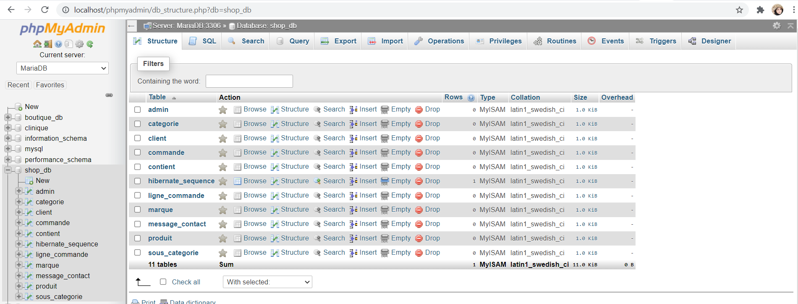

# project-jee-spring-shop
# Books App

On va présenter la partie Model d'une application Ecommerce basé en SPRING MVC, en construisant les différentes relations entre les entités (OneToMany,ManyToOne,ManyToMany,OneToOne) 

## implementation base de données

MySQL
- client
- message_contact
- marque
- categorie
- sous_categorie
- produit
- contient
- ligne_panier
- commande

=> Schema de BDD MySQL

## implementation Model (MVC)

Model
- Client
- Message_contact
- Marque
- Categorie
- Sous_categorie
- Produit
- Contient
- Ligne_panier
- Lommande
- Admin
  => Création automatique des entités dans la base de données MYSQL après l'execusion de projet

